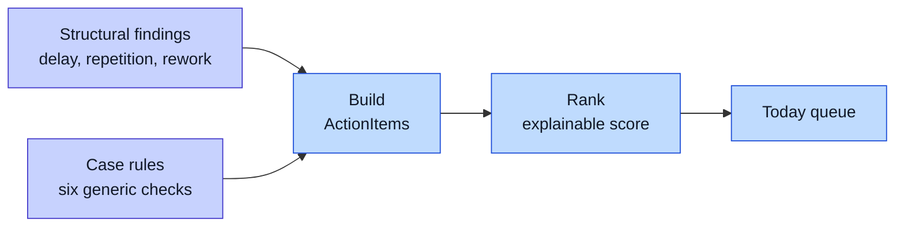
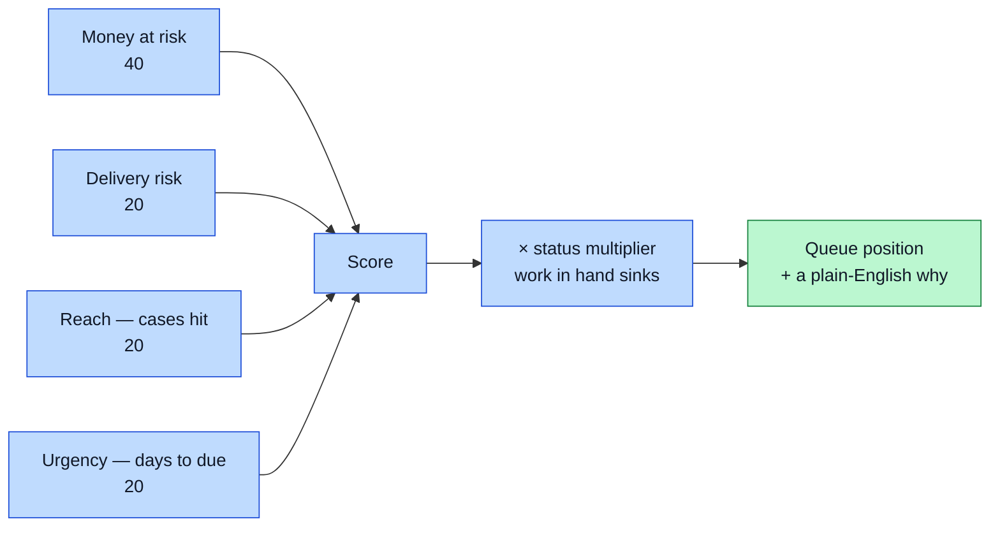
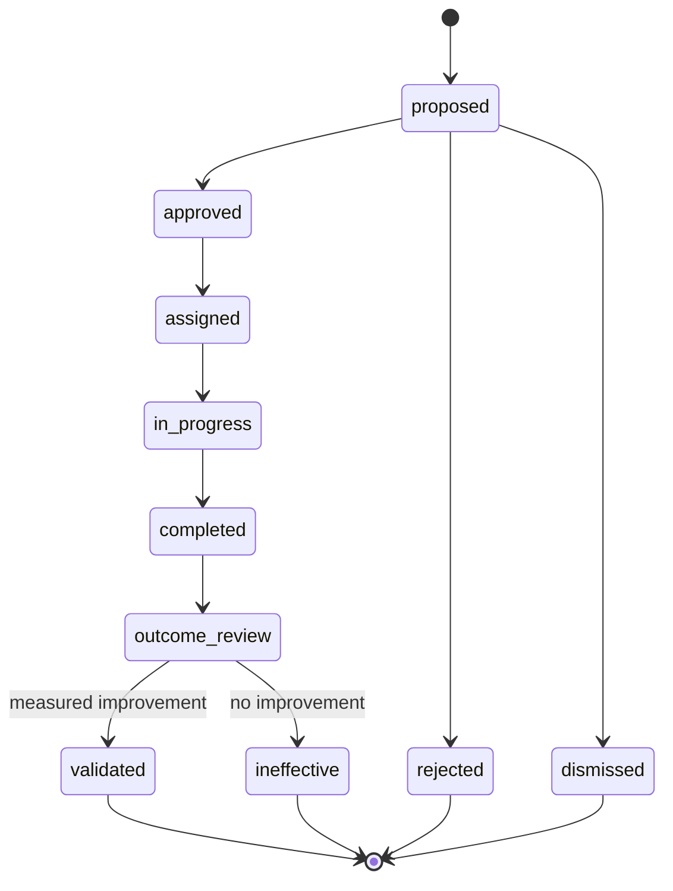

# Action Layer

This is the part that turns analysis into work. A chart tells a manager something is wrong. This layer tells a named person what to do about it today.

## Why it exists

A bottleneck finding is an analyst's answer: "stage X is slow across 40 cases." A worker's question is different: "which of *my* jobs needs me this morning, and why?"

So findings and case-level rules both feed one queue of **ActionItems**. Each item carries the evidence, the cases it affects, the likely cost, an owner, and a due date. The dashboard's main view is that queue — and after the tab fold, it is very nearly the whole dashboard: the workflow map and the bottleneck cards became *expandable evidence inside the card*, which is where a worker wants them.

Each firm's queue currently holds **12 open items** for foyle and joinery, and
**25** for advisory.

## Case-level rules

Alongside the structural detector, six generic rules ask the worker's question. All six read their thresholds from the firm's config block. None of them contains any firm's vocabulary.

| Rule | What it catches |
|---|---|
| `stage_sla_breach` | a case sitting at a stage past that stage's agreed limit |
| `stalled_case` | a case that has not moved at all and is not finished |
| `unowned_case` | a case whose latest activity has nobody's name on it |
| `unrealised_value` | a case carrying money that has not reached a revenue stage |
| `overloaded_owner` | one person holding more open cases than the load limit |
| `key_person_dependency` | one person doing nearly all the work at a stage |

The clock (`as_of`) defaults to the newest event in the log, so runs on synthetic data stay reproducible.

**Circularity guard again.** The data generator only records where it parked each case. The rules decide independently whether that breaches an SLA — and they flag strictly fewer cases than were parked. A test asserts it. See [Data Strategy](Data-Strategy).

All three firms now carry parked cases, so all three have a populated queue. But
neither the foyle nor the joinery drive holds a money column, so `unrealised_value`
is out of reach on those two **by design, not oversight**. A test pins that
absence, so it cannot quietly become a bug report.

## What an ActionItem holds

- **Evidence.** Traceable references back to a file, sheet, and row, plus the metrics behind the flag.
- **Affected cases.** The actual case ids, not just a count.
- **Business impact.** Money at risk, delivery risk, capacity or time loss — with an explicit `is_projection` flag, because these come from the firm's cost assumptions, not from observation.
- **Category.** One of `data_quality`, `case_action`, `process_intervention`. This is the routing decision. See [System Architecture](System-Architecture).
- **Owner and due date.** Defaulted per category from config, editable at the gate.
- **Provenance.** Whether a structural detector or a case rule produced it, and
  which drive the analysis behind it came from.
- **Grounding.** The past resolutions the diagnosis retrieved, with similarity
  scores, shown on the card itself. Note that this is only populated when the
  diagnosis runs **online** — an offline export produces grounding-free data that
  looks identical in shape.

## Ranking is explainable, not a model

The queue is sorted by a weighted sum of normalised parts, and every item can show its own arithmetic:

No opaque scoring. Each item stores the sentence that explains its own points, so a user can argue with the ranking rather than obey it.

## The lifecycle

Approving an item creates an **Intervention** — a commitment with a baseline measurement taken at approval time, a success metric, an owner, and a review date.

`rejected` and `dismissed` are terminal off-ramps. They stay in the audit trail — keeping the history is the point — they simply never become guidance.

## Projections and observations never share a field

This distinction runs through the whole layer:

| Projection (a guess, made up front) | Observation (a measurement, made later) |
|---|---|
| `BusinessImpact.is_projection` | `InterventionOutcome.observed_value` |
| `Intervention.expected_improvement_pct` | measured against a later `AnalysisSnapshot` |

The UI labels them differently. The effectiveness verdict never reads a projection. And `effective` is tri-state: `None` means "not enough evidence yet", which is the honest answer most of the time.

## Measuring an outcome

An intervention is measured against a **later** analysis of the same drive, run through the same approved mapping. That is what `ingest.py --drive <path>` is for — re-analysing a later snapshot without a second trip through Gate 1. In the synthetic data, `messy_advisory_followup` is the advisory firm's drive a fortnight on, after the queue was worked. The [Live Simulator](Live-Simulator) supersedes that fixture: it produces later snapshots that actually respond to what was approved.

Matching a finding across those two analyses uses a **content key**, not the
finding's id. Ids are assigned by rank order and move when the data moves. See
[Bottleneck Detection](Bottleneck-Detection).

Only an intervention that is `validated`, shows a real improvement against that later analysis, **and** has a human confirming the reading becomes trusted knowledge. See [RAG Diagnosis](RAG-Diagnosis).

The comparison also refuses to run on a snapshot it cannot vouch for — simulated
or unknown origin both fail closed. See [System Architecture](System-Architecture).

## Deliberately light

The action layer is pure Python and pydantic. It imports no vector store, no parquet library, and no model runtime, so it can run inside the small processes the dashboard shells out to. See [Tech Stack](Tech-Stack).
