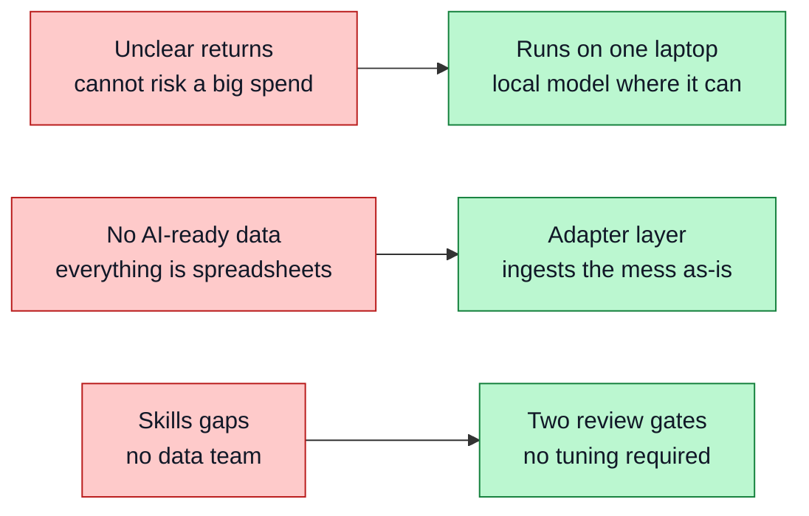

# Background

## Small firms and the AI gap

Most firms are small. They employ most workers. Yet they use AI far less than large firms do. The OECD reports a wide gap: about 40% of large firms use AI against about 12% of small firms.

The cause is not skill or ambition. It is resources. Small firms hit three walls — and each one dictates a design choice in this project:

A useful system for small firms must clear all three walls. It must be cheap, work with messy data, and run without experts.

## What a bottleneck is

A bottleneck is a stage in a workflow where work piles up. Cases wait too long. Or the same step repeats. Or work loops back to an earlier stage.

Take an educational-tourism firm. It books students onto courses, places them with host families, and arranges transport. If host-family checks lag, students wait. That stage is a bottleneck.

This project detects three bottleneck types:

- **Delay** — cases wait too long to enter or leave a stage.
- **Repetition** — a duplicate-work stage shows up.
- **Rework** — work loops back to an earlier stage.

## The analyst's question and the worker's question

Those three types answer an analyst's question: *which stage is broken?* That is useful to a manager and useless to the person at the desk.

So the system also asks the worker's question: *which of my jobs needs me today, and why?* Case-level rules answer that one, and both kinds of finding feed a single queue. See [Action Layer](Action-Layer).

## Why grounded diagnosis

Finding a bottleneck is not enough. Staff need to know why it happens and what to do. A plain language model can guess, but a guess is not evidence.

This project grounds each suggestion in past fixes. It searches a store of resolutions and shows the ones it used. The user sees the working, not just the answer. This is retrieval-augmented generation, or RAG. The [RAG Diagnosis](RAG-Diagnosis) page covers it.

## Why keep a human in the loop

The system suggests. A person decides. This keeps accountability with the firm, not the model. It fits the ACM Code of Ethics on human oversight.

The design has two approval gates, not one. A person approves the schema mapping before any data is trusted. A person approves each action before it is assigned or run. The [Human-in-the-Loop](Human-in-the-Loop) page explains both.

## Why an approval is not a result

There is a tempting shortcut here: treat an approved fix as a proven fix and feed it straight back into the knowledge store. That would let the system fill up with advice nobody has ever checked.

This project refuses the shortcut. An approval creates a commitment with a baseline and a review date. Only a later measurement showing real improvement — confirmed by a person — turns a fix into retrievable guidance. See [RAG Diagnosis](RAG-Diagnosis).
