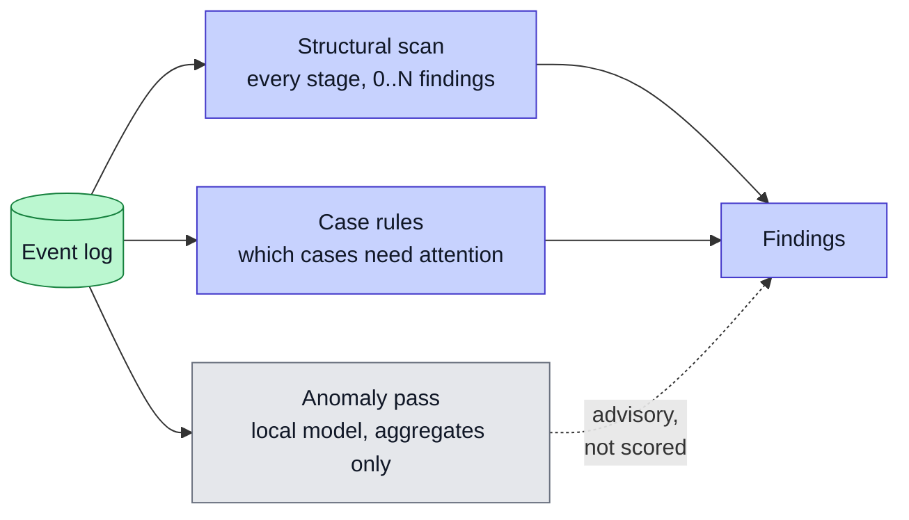
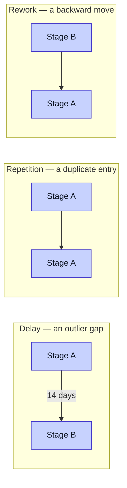

# Bottleneck Detection

This is the first step of the fixed pipeline core.

## Three detectors, one event log

The structural scan answers the analyst's question — *which stage is broken*. The case rules answer the worker's — *which jobs need me*. See [Action Layer](Action-Layer) for the rules.

## Dynamic detection

Older versions used markers. A marker told the system where to look. That does not scale, and it hides per-firm tuning inside the core.

The current detector is dynamic. It scans every stage in the workflow and reports zero to N findings. It uses no marker config. The number of bottlenecks is a property of the data, not a setting. The same detector runs for every firm.

## The three patterns

The detector looks for three structural patterns. Each is a shape in the event log, not a label:

- **Delay.** Cases wait too long entering or leaving a stage. The detector finds outlier gaps in time.
- **Repetition.** A duplicate-work stage appears. The detector finds repeated stage entries.
- **Rework.** Work loops back to an earlier stage. The detector finds backward transitions.

Each finding names the stage, the pattern type, a metric, and the affected cases. This gives the diagnosis step something concrete to work with.

## The baseline it beats

The project also runs a simple baseline for contrast. The baseline checks whether a marker is present. It works for plain delays. It falls apart on structural repetition and rework, because presence alone cannot see a loop or a duplicate.

The gap between the baseline and the dynamic detector is the argument for statistical detection. The [Evaluation](Evaluation) page shows the numbers.

## The anomaly pass

On top of the main detector, there is an optional anomaly pass. It runs on a local model through Ollama. It looks at aggregate stats only and adds "AI-spotted" cards.

This pass is advisory. It is not scored against ground truth. It costs nothing to run, because the model is local. The data never leaves the machine. If no local model is running, the pass skips and nothing breaks.

## Why this is the core, not the adapter

The detector is the academic constant. It is the same code for the placement firm, the joinery firm, and the advisory firm. It has no per-firm rules. That is what makes it part of the fixed core, not the thin adapter.
