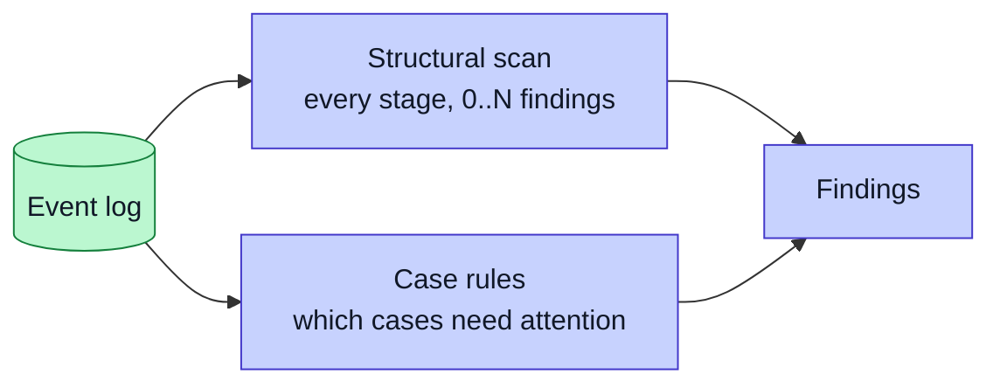
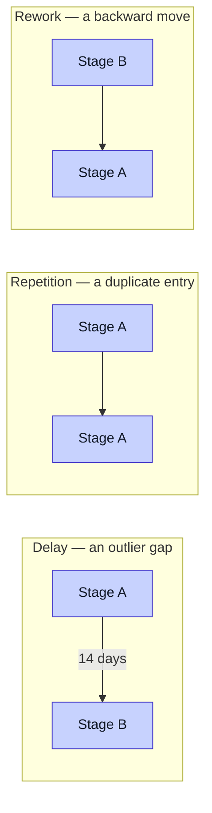

# Bottleneck Detection

This is the first step of the fixed pipeline core.

## Two detectors, one event log



The structural scan answers the analyst's question — *which stage is broken*. The case rules answer the worker's — *which jobs need me*. See [Action Layer](Action-Layer) for the rules.

## Dynamic detection

Older versions used markers. A marker told the system where to look. That does not scale, and it hides per-firm tuning inside the core.

The current detector is dynamic. It scans every stage in the workflow and reports zero to N findings. It uses no marker config. The number of bottlenecks is a property of the data, not a setting. The same detector runs for every firm.

## The three patterns

The detector looks for three structural patterns. Each is a shape in the event log, not a label:



- **Delay.** Cases wait too long entering or leaving a stage. The detector finds outlier gaps in time.
- **Repetition.** A duplicate-work stage appears. The detector finds repeated stage entries.
- **Rework.** Work loops back to an earlier stage. The detector finds backward transitions.

Each finding names the stage, the pattern type, a metric, and the affected cases. This gives the diagnosis step something concrete to work with.

## The baseline it beats

The project also runs a simple baseline for contrast. The baseline checks whether a marker is present. It works for plain delays. It falls apart on structural repetition and rework, because presence alone cannot see a loop or a duplicate.

The gap between the baseline and the dynamic detector is the argument for statistical detection. The [Evaluation](Evaluation) page shows the numbers.

## A finding's identity is its content, not its rank

This is a small detail with a large consequence. A finding's id — `BN001`,
`BN002` — is assigned by **rank order**. Rank order changes when the data
changes. So an id is not a safe way to match a finding in one analysis against
the same finding in a later one.

`detection/detect.py::finding_key` derives a stable content key instead:

```
type :: stage :: metric_label
```

The action layer joins diagnosis prose to findings on that key, and falls back to
the positional id only for an export written before the key existed. Two analyses
of the same drive can therefore be compared, which is what outcome measurement
needs. See [Action Layer](Action-Layer).

## An earlier local-model pass, removed

An earlier build ran an extra exploratory pass on a local model through Ollama,
producing advisory "AI-spotted" cards that were never scored against ground
truth. It was withdrawn during development, and the code was removed. See
[Tech Stack](Tech-Stack) for why, and what the write-up makes of it.

## Why this is the core, not the adapter

The detector is the academic constant. It is the same code for the placement firm, the joinery firm, and the advisory firm. It has no per-firm rules. That is what makes it part of the fixed core, not the thin adapter.
