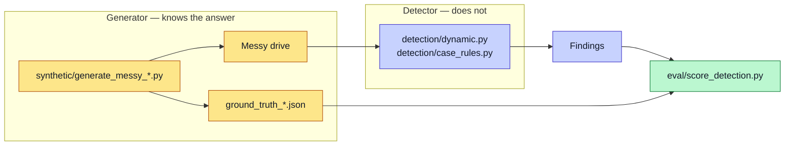
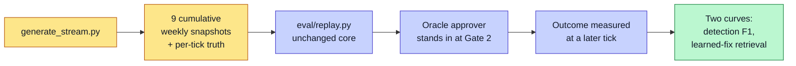

# Data Strategy

## Synthetic first

All data in this repo is synthetic. The system uses no live company data. This keeps the build safe to share and safe to test.

There is one messy drive per firm:

| Drive | Fictional firm | Workflow |
|---|---|---|
| `messy_foyle` | Foyle International | educational-tourism placement |
| `messy_joinery` | McCrossan Joinery | trades and fit-out job pipeline |
| `messy_advisory` | Northstar Advisory | professional services, lead-to-cash |
| `messy_advisory_followup` | Northstar Advisory | the same drive a fortnight later |

Each drive is a folder of deliberately messy spreadsheets. Column names drift. Statuses are free text. Files repeat data. This is on purpose. It mirrors how small firms really store data.

The advisory drive is the commercially recognisable one — money, capacity, and delivery risk are all explicit in the data. The other two are the contrasting evidence that the same core works on very different workflows.

## Ground truth by design

The system injects three bottleneck patterns on purpose: delay, repetition, and rework. Because the code injects them, the ground truth is known before detection runs. The patterns are structural, not labels:

- **Delay** — an outlier gap between stages.
- **Repetition** — a literal duplicate stage entry.
- **Rework** — a genuine backward transition.

This gives a clean test. The system knows what it planted, so it can score what detection finds.

## The circularity guard

There is a risk when one person builds the data and also builds the detector. The detector could just learn the injection rules. That would prove nothing.

Note that no arrow runs from the ground truth into the detector. The two code paths are kept apart. The detector scans for structure, not for planted labels. So a correct detection is a real result, not a leak.

The same guard applies to the case rules. The advisory generator records only *where it parked* each engagement; the rules decide independently whether that breaches an SLA. They flag strictly fewer engagements than were parked, and a test asserts it. See [Action Layer](Action-Layer).

## Three contrasting firms

The three firms are different on purpose. One places students. One fits out buildings. One sells professional advice and invoices for it. Their spreadsheets look nothing alike, and the joinery firm even renames its headers in a way that breaks a naive baseline.

Running all three through one core is the test of generalisability. Firms two and three each needed a config block, a drive, and an approved mapping — no new reader, detector, or action code.

## Longitudinal replay

A single snapshot shows one moment. Real firms change week to week. So the project also tests the system over time.

A generator writes nine cumulative weekly snapshots per firm, plus a ground truth for each week. A replay harness runs each week through the unchanged core. It scores detection against a moving truth. A simulated approver stands in at Gate 2 — the write-up states plainly that this approver is an **oracle**, not a person.

The replay is outcome-gated like the real loop: the oracle approves, "does" the work, and a later tick measures it. Only a measured improvement is validated and embedded.

**Two honesty notes carried into the write-up:**

1. The stream is a *recording*, not a counterfactual. An intervention approved at tick *t* cannot change what tick *t+1* contains. A validated outcome there evidences the **measurement machinery**, not causation.
2. Each tick record carries both curves — what the outcome-gated loop trusts, and what the older approval-gated loop would have trusted by the same tick — so the behaviour change is a reported result, not a silent regression.

The [Evaluation](Evaluation) page reports the curves.
