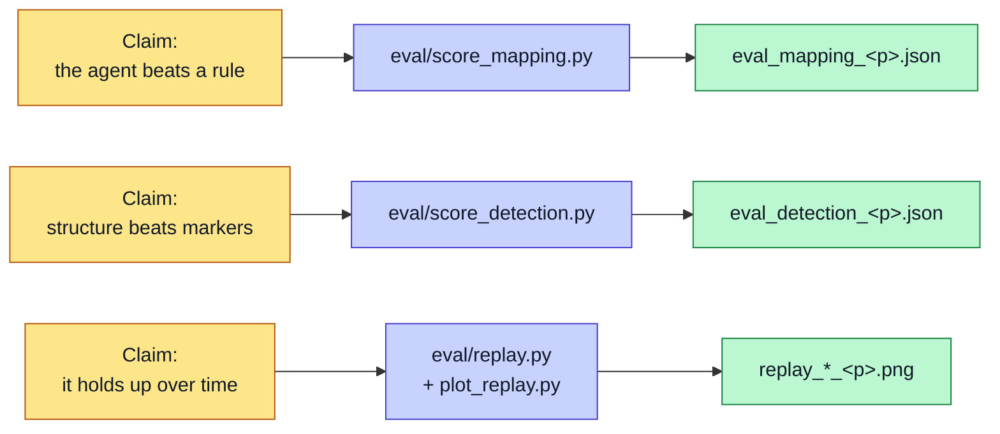

# Evaluation

The project tests each claim against the seeded ground truth. All numbers below come from repeatable scripts in the repo.

## What is scored where

## Mapping accuracy (the headline result)

This tests the mapping agent. It scores how well the system maps messy columns to the clean schema. The score is an F1 across three conditions: a heuristic baseline, the LLM agent, and the human-approved result.

| Firm | Baseline F1 | LLM F1 | Human F1 |
|---|---|---|---|
| foyle | 0.846 | 0.968 | 1.000 |
| joinery | 0.308 | 0.909 | 1.000 |
| advisory | 0.500 | 0.766 | 1.000 |

All three rows are now online runs, with no outstanding caveats.

Read the joinery row first. The baseline scores 0.308 because the joinery firm renames its headers, and a naive match cannot follow the change. The LLM agent lifts this to 0.909. The human gate closes the rest.

This gap is the argument for the LLM agent. A simple rule breaks on renamed headers. The agent does not.

**Two results in this table are worth reading closely rather than smoothing over.**

**Advisory is the weakest online condition — 0.766 — and the cause is precision,
not recall.** Recall is 1.000; precision is 0.621, across 11 column errors. The
agent *over-includes* columns on this profile rather than missing them. That is a
different failure mode from joinery's, and a milder one: the human gate has
something to prune rather than something to discover.

**Foyle's human-approved condition is genuinely mixed.** Column F1 is 1.000 —
every column mapping was corrected. But `role_accuracy` is only 0.6, because the
approver labelled `host families 2026.xlsx` as `ignore` where ground truth says
`reference`, and `staff phone list.xlsx` as `notes` where ground truth says
`ignore`. Two file roles were wrong.

That is a **finding about Gate 1**, not a defect to fix. The human reviewer
catches column-level semantics reliably and can still mislabel what a whole file
is *for*. A gate is a control, not a guarantee.

## Detection accuracy

This tests the bottleneck detector. It scores precision, recall, and F1 per pattern type against the seeded ground truth. It compares the marker baseline with the dynamic detector.

| Firm | Baseline macro-F1 | Dynamic macro-F1 |
|---|---|---|
| foyle | 0.486 | 1.000 |
| joinery | 0.487 | 1.000 |
| advisory | 0.471 | 1.000 |

The baseline collapses on structural repetition and rework. Presence alone cannot see a loop or a duplicate. The dynamic detector finds the structure and scores a perfect macro-F1 on this synthetic data.

This mirrors the mapping result: a simple rule fails where a structural method holds.

**Why foyle and joinery moved.** These two sat at 0.524 and 0.523 in an earlier
run. They fell when parked operational cases were seeded into both drives
alongside the existing structural patterns. Recall held at 1.0 for every pattern
type on both firms throughout — nothing became harder to find. What fell was
baseline *precision* on repetition and rework, because the baseline flags any
case that merely passes through a marker-named stage, and the new parked cases do
exactly that without exhibiting the pattern. Foyle's repetition F1 went 0.286 →
0.250 and its rework F1 0.286 → 0.207.

So the gap between baseline and dynamic got **wider**, not narrower. That is a
stronger result for statistical detection, not a regression. Advisory's drive was
untouched by that change, so its figures stand unchanged.

## Longitudinal replay

This tests the system over time, not on one snapshot.

The replay runs nine cumulative weekly snapshots per firm through the unchanged core. A simulated approver stands in for the human at Gate 2, so the learning loop runs end to end. The write-up states plainly that this approver is an oracle, not a real person.

Two curves come out.

**Detection F1 over time.** The detector tracks a moving ground truth. At one week
for the joinery firm, a gap threshold wobbles. Precision dips, the gate rejects
the false positives, and F1 recovers. The project reports this honestly rather
than hiding it.

**The learning curve — and this is the honest headline.** It was previously cited
as "learned-hit rate 0 → 1 over the run". That claim **does not survive outcome
gating**. Re-run under the current rule, for both firms:

| Curve | tick 1 → 9 |
|---|---|
| `lifecycle.validated` — what the outcome-gated loop trusts | **0, for the whole window** |
| `lifecycle.approved_unmeasured` — what the old approval-gated loop would have trusted | climbs to **3** and holds (foyle by tick 4, joinery by tick 6) |

No oracle-approved fix was ever completed and re-measured against a later tick
showing genuine improvement, so nothing was promoted into the resolution store.
`replay_learned_
.json` is written only on a promotion, so it does not exist for
either firm.

**The cause is traced to source, and it is structural rather than a bug.**
Affected-case counts only *grow* as more of the recording is revealed — 2, then 3,
then 4 per intervention — so the outcome comparison can never return a measured
improvement inside this window. Interventions land either `ineffective` or inside
the 10% noise band. A test proves the validation path does work when a finding
genuinely disappears, so the mechanism is sound. The replay simply cannot produce
the counterfactual a measured improvement requires.

The honest end-of-replay state is therefore: **3 fixes approved and tracked,
0 proven to work.** That is a better result to report than a curve that climbed
because approval was mistaken for proof.

Carrying **both** counts in each tick record is what makes the behaviour change a
reported result rather than a silent regression.

> **These curves predate the [Live Simulator](Live-Simulator).** The simulator is
> the answer to the limitation above — a world where an approval can actually
> change the next snapshot. Retargeting the replay onto it is not done yet, and is
> where `validated` finally gets a chance to move off 0.

The replay writes its results to the outputs folder and never touches the dashboard's real state. Replay-learned entries are prefixed `RES-RPL-`. A fresh reset keeps each run repeatable. `replay_pending_
.json` and `replay_interventions_
.json` are the artefacts that substantiate both curves.

## Generalisability

Three firms — an educational-placement firm, a joinery firm, and a professional-services firm — run through one pipeline core. Firms two and three each needed a config block, a synthetic drive, and an approved mapping. Neither needed a single line of new reader, detector, or action code.

That is the evidence behind the main claim. See [Data Strategy](Data-Strategy).

## Other measures

- **RAG retrieval quality.** Retrieval relevance, measured with MRR or NDCG, where a relevant hit matches both the firm and the bottleneck type.
- **Human-in-the-loop metrics.** Correction counts and time to decide, logged at both gates.
- **Qualitative review.** A planned structured walkthrough with two or three experts, on trust, usability, and recommendation quality.

## Honest limitations

The project states its limits:

- The data is synthetic. One person designed the injection and the evaluation. The circularity guard reduces this risk but does not remove it. See [Data Strategy](Data-Strategy).
- The timing data comes from development runs, not a controlled user study.
- The replay approver is an oracle, not a real user.
- The replay stream is a recording, not a counterfactual. A validated outcome inside it evidences the measurement machinery, not causation.
- The simulator's responsiveness is **authored**. `effect_prob` is a config constant. It demonstrates that an improvement can be *observed*, not that these actions would help a real firm. See [Live Simulator](Live-Simulator).
- The replay curves predate the simulator and have not yet been regenerated against it.
- Impact-history sparklines were removed with the tab fold. There is no trend view in the dashboard, and the write-up must not claim one.

These limits are stated in the write-up, not hidden.
