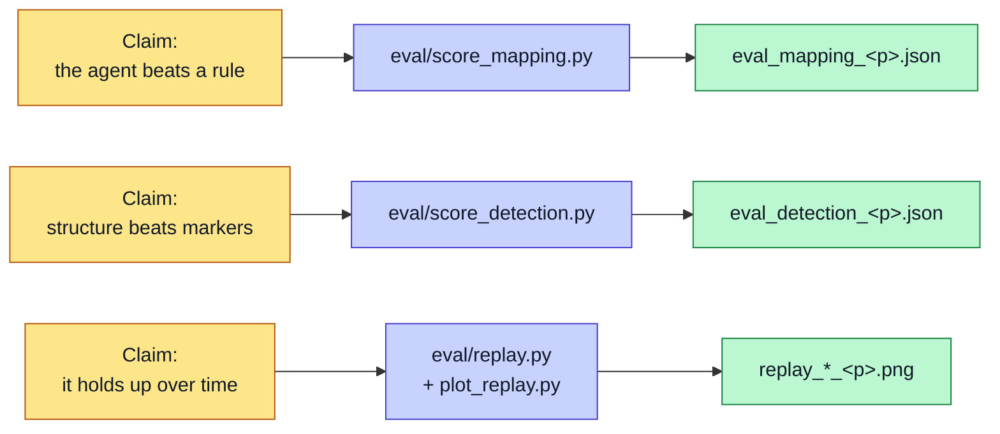

# Evaluation

The project tests each claim against the seeded ground truth. All numbers below come from repeatable scripts in the repo.

## What is scored where

## Mapping accuracy (the headline result)

This tests the mapping agent. It scores how well the system maps messy columns to the clean schema. The score is an F1 across three conditions: a heuristic baseline, the LLM agent, and the human-approved result.

| Firm | Baseline F1 | LLM F1 | Human F1 |
|---|---|---|---|
| foyle | 0.846 | 0.968 | 1.000 |
| joinery | 0.308 | 0.909 | 1.000 |
| advisory | 0.500 | *not yet run online* | 1.000 |

Read the joinery row first. The baseline scores 0.308 because the joinery firm renames its headers, and a naive match cannot follow the change. The LLM agent lifts this to 0.909. The human gate closes the rest.

This gap is the argument for the LLM agent. A simple rule breaks on renamed headers. The agent does not.

**Two live caveats on this table, stated rather than hidden:**

1. The advisory proposal was generated with `--offline`, so its baseline and "LLM" columns are the same heuristic. Running `python -m audit.run --profile advisory` online (one API call) fills the middle column.
2. The foyle **approved** mapping was re-approved in the browser and now scores 0.800, not 1.000. This is the mapping-drift hazard: approving in the dashboard overwrites `mappings/approved_<profile>.json`. `git checkout mappings/approved_foyle.json` restores the 1.000 figure.

## Detection accuracy

This tests the bottleneck detector. It scores precision, recall, and F1 per pattern type against the seeded ground truth. It compares the marker baseline with the dynamic detector.

| Firm | Baseline macro-F1 | Dynamic macro-F1 |
|---|---|---|
| foyle | 0.524 | 1.000 |
| joinery | 0.523 | 1.000 |
| advisory | 0.471 | 1.000 |

The baseline collapses on structural repetition and rework. Presence alone cannot see a loop or a duplicate. The dynamic detector finds the structure and scores a perfect macro-F1 on this synthetic data.

This mirrors the mapping result: a simple rule fails where a structural method holds.

## Longitudinal replay

This tests the system over time, not on one snapshot.

The replay runs nine cumulative weekly snapshots per firm through the unchanged core. A simulated approver stands in for the human at Gate 2, so the learning loop runs end to end. The write-up states plainly that this approver is an oracle, not a real person.

Two curves come out:

- **Detection F1 over time.** The detector tracks a moving ground truth. At one week for the joinery firm, a gap threshold wobbles. Precision dips, the gate rejects the false positives, and F1 recovers. The project reports this honestly rather than hiding it.
- **Learned-fix retrieval.** The rate climbs as validated fixes enter the store. This shows the learning loop working: the system retrieves its own proven fixes in later weeks.

Each tick record carries **both** lifecycle counts — `validated` (what the outcome-gated loop trusts) and `approved_unmeasured` (what the older approval-gated loop would have trusted by the same tick). The difference between them is a reported result, not a silent regression.

> ⚠️ **Re-run needed before citing.** The committed replay outputs predate the outcome-gated learning loop. Re-run `eval.replay` for foyle and joinery and re-cite: the learning curve is expected to shift right, and may sit lower. That is the correct behaviour, not a regression.

The replay writes its results to the outputs folder and never touches the dashboard's real state. Replay-learned entries are prefixed `RES-RPL-`. A fresh reset keeps each run repeatable.

## Generalisability

Three firms — an educational-placement firm, a joinery firm, and a professional-services firm — run through one pipeline core. Firms two and three each needed a config block, a synthetic drive, and an approved mapping. Neither needed a single line of new reader, detector, or action code.

That is the evidence behind the main claim. See [Data Strategy](Data-Strategy).

## Other measures

- **RAG retrieval quality.** Retrieval relevance, measured with MRR or NDCG, where a relevant hit matches both the firm and the bottleneck type.
- **Human-in-the-loop metrics.** Correction counts and time to decide, logged at both gates.
- **Qualitative review.** A planned structured walkthrough with two or three experts, on trust, usability, and recommendation quality.

## Honest limitations

The project states its limits:

- The data is synthetic. One person designed the injection and the evaluation. The circularity guard reduces this risk but does not remove it. See [Data Strategy](Data-Strategy).
- The timing data comes from development runs, not a controlled user study.
- The replay approver is an oracle, not a real user.
- The replay stream is a recording, not a counterfactual. A validated outcome inside it evidences the measurement machinery, not causation.
- The advisory LLM mapping column is not yet filled from an online run.

These limits are stated in the write-up, not hidden.
