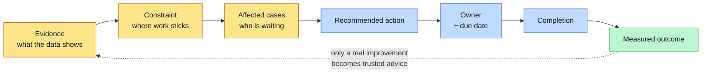
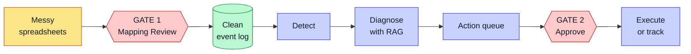

# SME Bottleneck Pipeline — Project Wiki

This wiki explains an MSc research project for the COM748 module at Ulster University (MSc Artificial Intelligence).

**Project title:** Agentic Workflow Optimisation for SME Operations — An End-to-End Pipeline for Bottleneck Detection, RAG-Based Diagnosis and Human-in-the-Loop Approval.

**Student:** Emmett Murray (B00810618)
**Supervisor:** Dr Jose Santos
**Case study partner:** Foyle, an educational-tourism SME.

## What the project does

The system reads messy spreadsheet data from a small business. It finds where work gets stuck. It explains why, using past fixes as evidence. Then it turns each finding into a piece of work someone can pick up today. A person approves every step that changes data or advises staff.

It runs on one laptop. It uses no live company credentials. All data in this repo is synthetic.

## One-line summary

A lightweight, locally-run pipeline that ingests messy SME data, detects operational bottlenecks, diagnoses them with grounded suggestions, and carries out approved fixes — with a human approving every consequential action.

## The loop the worker sees

Charts and bottleneck summaries are supporting evidence. The product is the queue of work that comes out of them.

See [Action Layer](Action-Layer) for how a finding becomes a task with an owner.

## The pipeline at a glance

Each box is a page below.

## How to read this wiki

Use the sidebar. The pages follow the project from start to finish:

1. Start with the [Introduction](Introduction) for the problem and the aim.
2. [Background](Background) covers the SME context and the research gap.
3. [System Architecture](System-Architecture) is the core design, and [Data Strategy](Data-Strategy) covers the data it runs on.
4. The pipeline pages walk through each stage: [Ingestion and Mapping](Ingestion-and-Mapping), [Bottleneck Detection](Bottleneck-Detection), [RAG Diagnosis](RAG-Diagnosis), [Action Layer](Action-Layer), [Human-in-the-Loop](Human-in-the-Loop), and [Remediation](Remediation).
5. [Live Simulator](Live-Simulator) is the *second* system — a simulated firm that reacts to what the product recommends. It is what makes an approved fix measurable.
6. [Evaluation](Evaluation) reports the results.
7. [Privacy and Ethics](Privacy-and-Ethics), [Tech Stack](Tech-Stack), and [How to Run](How-to-Run) cover the practical side.
8. The [Glossary](Glossary) defines the terms.

## Status

This is a work in progress. It is a dissertation build, not a production product. See [Scope and Status](Scope-and-Status) for what is in scope and what is not.
