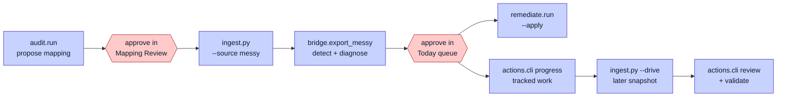

# How to Run

This page shows how to run the pipeline and the dashboard. The commands target Windows and PowerShell, because that is the build machine.

## Before you start

- Python, with the pinned requirements installed in a venv at `.venv`.
- Optional: an Anthropic API key in a local `.env` file, for the agent steps. Without it, use the offline flags.
- Optional: Ollama with a local model, for the anomaly pass. Without it, the pass skips.

On Windows, call the venv Python by its full path. The bare `python` command hits a Store stub. Set the output encoding first, because some status values use characters that the default code page rejects.

```
$env:PYTHONIOENCODING="utf-8"
```

## The order of the steps



The ingest step errors on purpose if there is no approved mapping. That is Gate 1 being enforced, not a bug.

## The light path (no API key)

Every agent step has an offline mode. This runs the whole pipeline with no API key, at lower accuracy. It uses heuristics and templates instead of the model.

```
.venv/Scripts/python.exe -m audit.run --profile foyle --offline
# review and approve in the dashboard Mapping Review tab
.venv/Scripts/python.exe ingest.py --source messy --profile foyle
.venv/Scripts/python.exe -m bridge.export_messy --profile foyle --offline
.venv/Scripts/python.exe -m remediate.run --profile foyle
.venv/Scripts/python.exe -m eval.score_mapping --profile foyle
```

## The full path (with API key)

Drop the `--offline` flags to use the Claude agents for mapping and diagnosis.

```
$env:PYTHONIOENCODING="utf-8"
.venv/Scripts/python.exe -m audit.run --profile foyle
# review and approve in the dashboard Mapping Review tab
.venv/Scripts/python.exe ingest.py --source messy --profile foyle
.venv/Scripts/python.exe -m bridge.export_messy --profile foyle
.venv/Scripts/python.exe -m remediate.run --profile foyle --apply
.venv/Scripts/python.exe -m eval.score_mapping --profile foyle
```

## Switch firms

Swap the profile. There is no new code. This is the generalisability point. Three profiles exist: `foyle`, `joinery`, and `advisory`.

```
.venv/Scripts/python.exe -m audit.run --profile advisory --offline
# approve, then run the same steps with --profile advisory
```

## The action queue from the command line

The dashboard is the normal way in, but the same lifecycle is scriptable.

```
.venv/Scripts/python.exe -m actions.cli queue    --profile advisory
.venv/Scripts/python.exe -m actions.cli decide   --profile advisory --action-id <id> --decision approve --owner "Sam" --due-date 2026-08-07
.venv/Scripts/python.exe -m actions.cli progress --profile advisory --action-id <id> --status completed
```

## Measuring whether it worked

Re-analyse a **later snapshot of the same drive** through the already-approved mapping, then review and confirm the outcomes. No second trip through Gate 1.

```
.venv/Scripts/python.exe ingest.py --drive data/synthetic/messy_advisory_followup --profile advisory
.venv/Scripts/python.exe -m actions.cli review   --profile advisory
.venv/Scripts/python.exe -m actions.cli validate --profile advisory --intervention-id <id> --effective yes
```

Only a measured improvement that a person confirms becomes trusted knowledge. See [Action Layer](Action-Layer).

## The dashboard

Run the backend and the UI in two terminals.

```
# terminal 1 — backend
cd hitl-react/api
.venv/Scripts/python.exe -m uvicorn main:app --reload --port 8000

# terminal 2 — UI
cd hitl-react
npm run dev
```

The UI serves at `http://localhost:5173`. Once each firm has been built once, the dashboard switches between them at once.

## The longitudinal replay

This is the over-time evaluation. It is eval-side only and does not touch the pipeline core or the dashboard's state.

```
.venv/Scripts/python.exe synthetic/generate_stream.py --profile foyle
.venv/Scripts/python.exe -m eval.replay --profile foyle
.venv/Scripts/python.exe -m eval.plot_replay --profile foyle
```

This writes nine weekly snapshots, replays them, and draws the result curves into the outputs folder. Add `--llm` to use the model during replay. The [Evaluation](Evaluation) page explains the curves.

## If something breaks

- **Eval numbers move without reason.** An approval in the browser overwrote the approved mapping. Restore it: `git checkout mappings/approved_*.json`.
- **A status value crashes the console.** Set the UTF-8 encoding shown at the top.
- **Ingest refuses to run.** There is no approved mapping for that profile. That is Gate 1 working.
- **The anomaly pass produces nothing.** No local model is running. The pass skips by design; nothing else is affected.
- **The 7B local model will not load.** It needs about 6 GB of RAM. Use `OLLAMA_MODEL=qwen2.5:1.5b` on a smaller machine.
