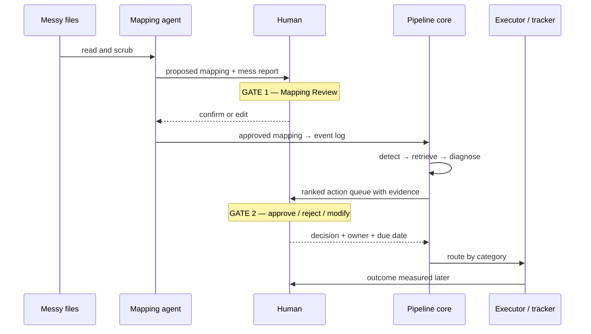

# Human-in-the-Loop

The system suggests. A person decides. This holds at two gates.

## Why two gates

Most systems have one approval step. This one has two, because there are two moments where trust matters:

- The system must trust the data before it reasons over it.
- The firm must trust an action before it is assigned or run.

So there are two gates, in order.

## Gate 1: Mapping Review

This gate runs first, at ingestion.

The mapping agent proposes how each messy column maps to the clean schema. It also flags the problems it found. The user reviews the proposal in the dashboard. The user confirms each mapping or edits it.

Nothing downstream trusts the data until the user approves. The system logs the corrections and the time to decide, into `mapping_decisions.jsonl`. These logs are the measurable human-in-the-loop numbers.

## Gate 2: Actions

This gate runs later, at execution.

For each item in the queue, the dashboard shows the diagnosis, the recommended action, the evidence behind it, the affected cases, and the projected impact. The user approves, rejects, or dismisses each one, and sets an owner and a due date.

Approving does not mean the same thing for every item, and the dashboard says which:

- A **machine-safe data-quality fix** writes cleaned copies of the spreadsheets.
- Anything else becomes a tracked task or a measurable experiment. No file is touched.

That routing is explained on [System Architecture](System-Architecture), and the item's own reason string tells the worker which one they are about to trigger.

An approval does **not** on its own become retrievable advice. Only a measured, human-confirmed improvement does. See [RAG Diagnosis](RAG-Diagnosis).

## The dashboard

A React dashboard drives both gates. Its primary view is **Today** — the action queue. Everything else is supporting evidence.

- **Today.** The ranked queue, with expandable evidence, owner and due date, progress controls, and outcome review.
- **Mapping Review.** Gate 1.
- **Pipeline stepper** and a workflow diagram.
- **Bottlenecks.** The structural findings, the anomaly cards, and the RAG evidence.
- **Fixes** and the remediation diff.
- A human-in-the-loop metrics strip and an impact panel with history.
- **"What was sent to the AI"** — the exact scrubbed payload the model saw.

A FastAPI backend acts as a thin bridge. It shells out to the pipeline and returns plain JSON. The dashboard holds no heavy libraries.

## How the gate pauses the run

The graph treats Gate 2 as a stop point. A fresh run pauses there and writes its state to a file. The user decides in the dashboard. A resume run reads the decision and carries on from the gate.

This is a two-phase run. There is no hidden state. The run-state file is the audit record. Every decision is logged with a timestamp in `decisions.jsonl`.

## Rejections are kept

`rejected` and `dismissed` are terminal, but they are not deleted. They stay in the lifecycle history. A record of what the firm chose *not* to do is part of the audit trail — and in the longitudinal replay, the gate rejecting a batch of false positives is visible in the curve. See [Evaluation](Evaluation).

## Why this matters

Keeping a human at both gates puts accountability with the firm, not the model. The system shows its working and its evidence at every step. This fits the ACM Code of Ethics on human oversight. See [Privacy and Ethics](Privacy-and-Ethics).
