# Ingestion and Mapping

This is the adapter layer and the first human gate.

## The problem it solves

A small firm's spreadsheets are messy. One firm calls a column "Student"; another calls it "Client". Dates sit in three formats. The same status reads "done", "Done", and "complete".

The pipeline core needs one clean shape. So something must map the messy columns to the fixed schema. That something is the mapping-inference agent.

## The flow

```mermaid
flowchart LR
    F["Messy drive<br/>*.xlsx"] --> SC["Scrub<br/>names → placeholders"]
    SC --> AG["Mapping agent<br/>structured call"]
    AG --> P["Proposal<br/>+ mess report"]
    P --> G1{{"GATE 1<br/>human confirms or edits"}}
    G1 --> AM["Approved mapping<br/>mappings/approved_&lt;profile&gt;.json"]
    AM --> RD["Mapped reader"]
    RD --> L[("Event log")]

    classDef inp fill:#fde68a,stroke:#b45309,color:#111827
    classDef ext fill:#e9d5ff,stroke:#7e22ce,color:#111827
    classDef gate fill:#fecaca,stroke:#b91c1c,color:#111827
    classDef store fill:#bbf7d0,stroke:#15803d,color:#111827
    class F,P,RD inp
    class SC,AG ext
    class G1 gate
    class AM,L store
```

The scrub sits **before** the agent, not after. Nothing leaves the machine unscrubbed.

## The mapping agent

The agent reads the messy files and proposes a mapping. For each file and column, it says how the column maps to the canonical schema. It also writes a short "mess report" that flags the problems it found.

The agent uses the Claude API. It calls the model with a fixed schema and gets back a structured result. A structured call means the output cannot come back malformed.

Before any sample data reaches the model, it passes through a scrub step. The scrub replaces names and other personal data with placeholders. So no raw personal data leaves the machine. The [Privacy and Ethics](Privacy-and-Ethics) page covers this.

There is also an offline mode. It skips the model and promotes a heuristic baseline as the proposal. This lets the system run with no API key, at lower accuracy.

## Gate 1: Mapping Review

The agent proposes. A human confirms.

The dashboard shows the proposed mapping and the mess report. The user confirms each mapping or edits it. Nothing downstream trusts the data until the user approves.

The system logs the corrections and the time to decide. These logs are the measurable human-in-the-loop numbers in the dissertation.

## From approved mapping to clean events

Once the mapping is approved, a mapped reader turns the messy folder into clean event rows. Each row becomes an `Event` with a case id, an activity, a timestamp, an actor, and a status. The reader drops duplicate rows on the key of case, activity, and timestamp.

The ingest step then writes the records, embeds the text into the knowledge store, and writes the event log. From here on, the data is clean and the core takes over.

## Re-reading the same drive later

`ingest.py --drive <path>` re-analyses a **later snapshot of the same drive** through the already-approved mapping. There is no second trip through Gate 1, because the schema has not changed — only the data has.

This is what makes outcome measurement possible end to end. Without it, you can approve a fix but never check whether it worked. See [Action Layer](Action-Layer).

## Why this is the adapter, not the core

This layer is the only part that changes per firm. The mapping differs per firm. The core does not. That split is what lets a new firm join with a config block and one mapping, and no new code.
