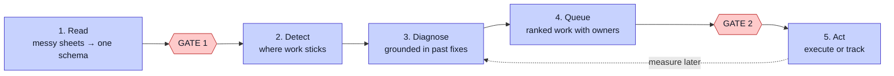

# Introduction

## The problem

Small and medium businesses run on messy data. Staff track work in spreadsheets. Column names drift. People type the same status ten different ways. Work stalls, and no one can see where or why.

Large firms fix this with data teams and expensive tools. Small firms cannot. They lack the budget, the staff, and the clean data these tools need.

The numbers show the gap. OECD data puts AI use at about 40% for large firms and about 12% for small firms. The gap comes from resource limits, not from a lack of good ideas. Small firms face unclear returns, no AI-ready data, and skills gaps.

## The aim

This project builds a system that a small firm can run without a specialist team. It must be light. It must run on one laptop. It must work with the messy data the firm already has.

The system does five things, and a person checks the work at two of them:

The system never changes data or advises staff on its own.

## The contribution

The main claim is **generalisability**. The same core runs for three very different firms with no new detection code. To add a firm, you add a config block, a drive, and one approved mapping. Nothing in the core changes.

This matters because it shows the approach can spread across small firms. It is not tuned to one business. The [Evaluation](Evaluation) page shows the evidence.

## What the product actually is

It is easy to mistake this for a dashboard of charts. It is not. The charts and the bottleneck summaries are **supporting evidence**. The product is the queue of work that comes out of them: what needs attention today, the evidence behind it, who owns it, when it is due, and whether it worked. See [Action Layer](Action-Layer).

## Why "agentic"

The system uses AI agents for two precise jobs: reading messy files and diagnosing bottlenecks. A third, local model runs an optional exploratory pass. A graph runs the steps in order and pauses at the approval gate.

Each agent proposes; a human disposes. The design keeps the human in charge of every choice that matters — and keeps an approval from being mistaken for proof that a fix worked.
