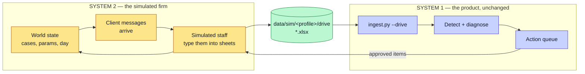
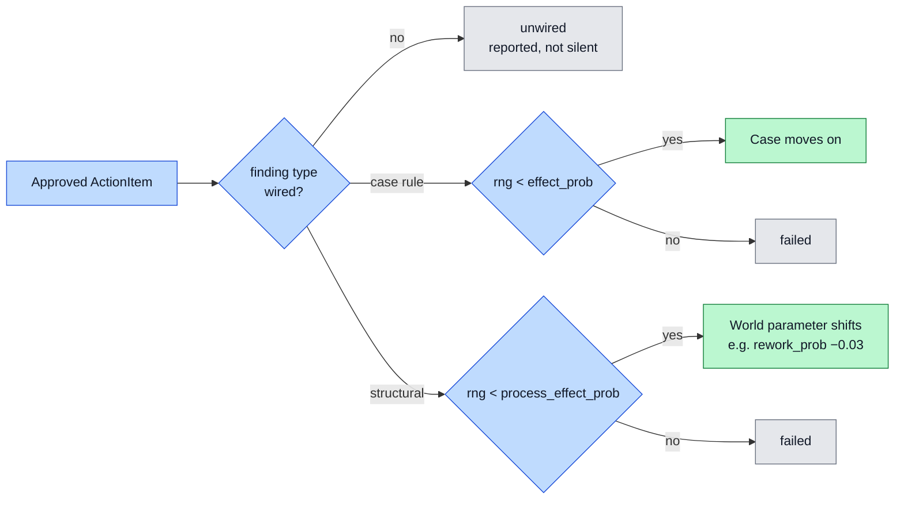

# Live Simulator

This page covers the second system in the project: a simulated small firm whose
world moves on, and reacts to what the product recommends.

It is **not** part of the product. Keeping the two apart is the point of the page.

## The problem it solves

Every earlier data path was a fixture. The drives were written once and never
changed. The weekly replay stream was a recording: nine snapshots written before
any analysis ran.

That creates a hole in the central claim. The system measures whether a fix
worked by re-analysing a later snapshot. But in a recording, an approval at week
2 cannot change what week 3 contains. Affected-case counts only ever grow as more
of the recording is revealed, so a measured improvement was structurally
impossible. The [Evaluation](Evaluation) page reports exactly that result:
`validated` sits at 0 for the whole replay window.

The simulator closes the hole. An approved action changes what the simulated
staff do next, so a finding's affected-case count can genuinely fall.

## Two systems, one interface



**The interface is the drive on disk, and nothing else.** The simulator writes
spreadsheets. The product reads spreadsheets. `ingest.py --drive <path>` already
existed for outcome measurement, so the product needed no change at all — it
does not know the simulator exists.

`simulator/` never imports `detection/`, `pipeline/`, `eval/`, or `bridge/`, and
never imports chromadb, pyarrow, or torch. See [Tech Stack](Tech-Stack).

## A day in the simulated firm

`advance()` runs five phases per day:

1. **Arrivals** — new cases enter the pipeline.
2. **Inbound** — clients send messages: a new enquiry, a query, a payment.
3. **Worker (messages)** — the simulated staff type each message into a sheet.
4. **Worker (approved)** — the staff act on approved ActionItems.
5. **Drift** — background movement: stages advance, some work stalls, owners get
   assigned.

Then it re-renders the whole drive. The output is a folder of messy spreadsheets
that looks exactly like the static ones: drifting headers, free-text statuses,
two different column layouts across tabs.

## Approved actions change the world — but not always

This is the design rule that stops the simulator flattering the product:

> **Effects are probabilistic, deliberately below 1.0.** Some approved actions
> fail. A simulator in which every approved fix works proves nothing.



Six finding types are wired to a modelled worker effect — the six case rules on
[Action Layer](Action-Layer). Their success rates run from 0.50 to 0.95.
Structural findings (delay, repetition, rework) take a different path: an
approved *process* intervention shifts a world parameter, at 0.50–0.60, and only
once per approval. Everything else is reported as **unwired** rather than
silently ignored, so the coverage can be stated honestly.

## Where the model is used, and where it is not

The split matters for the honesty of the demo:

- **The deterministic simulator decides what happens.** Which case moves, which
  approval lands, which client writes in. All seeded and reproducible.
- **The model only fills slots in a message.** Names, figures, phrasing. It is
  cached per (seed, day, message), so a replay costs nothing and runs offline.

If the model is unavailable, the messages fall back to templates and the world
behaves identically.

## Demo mode in the dashboard

The **Demo** tab drives all of this from the browser.

| What you see | What it is |
|---|---|
| A day counter advancing every few seconds | `POST /api/sim/<profile>/advance` |
| Client mail dripping into the left sidebar | The day's inbound messages |
| A message striking through | The simulated staff applied it to a sheet |
| Rows flashing in the grid on the right | The rendered drive, re-read |
| The counter **stalling ~50 seconds** at each week boundary | A real ingest and a real detection pass |
| The vitals strip moving after that pause | The product re-read the simulated drive |

`POST /api/sim/<profile>/analyse` is the one place the dashboard deliberately
points ingest at the simulated drive. The stall is deliberate: a counter that
kept ticking through the analysis would be showing a day count ahead of the data
it claims to reflect.

The tab only appears for a profile that has a simulator configured. Today that is
**advisory** alone.

## Running it from the command line

```
.venv/Scripts/python.exe -m simulator.cli --profile advisory --reset
.venv/Scripts/python.exe -m simulator.cli --profile advisory --advance 7
```

## Guarding the real evaluation from simulated data

Simulated days write real ActionItems into the real store. That is the whole
point, and it is also a hazard: a simulated week must never become the baseline
or the observation for a real intervention.

Two controls handle it:

- **Provenance.** Every `AnalysisSnapshot` records the drive it came from. The
  action queue export carries it too, and the Today tab shows an amber strip
  whenever the queue was built from an alternate drive.
- **Fail closed.** Outcome review refuses a snapshot whose origin is simulated
  *or* unknown. A snapshot written before the field existed counts as unknown and
  is refused rather than guessed at.

After any demo, restore the static drive before re-running an evaluation:

```
.venv/Scripts/python.exe ingest.py --source messy --profile advisory
```

## What this proves, and what it does not

Stated plainly, because it is easy to overclaim:

- **It proves the measurement machinery works end to end.** An approved action
  can now be followed by an observed fall in the thing it targeted. The
  pre-baked stream could not produce that, by construction.
- **It does not prove these actions would help a real firm.** How the world
  responds is authored — `effect_prob` is a config constant chosen by the same
  person who built the detector. It is a demonstration, not a controlled trial.
- **The "config block, zero engine code" claim does not yet hold here.**
  `simulator/render.py` hard-codes advisory filenames and generator method names.
  The *product* clears that bar on three firms; the simulator does not, and the
  write-up says so.

See [Data Strategy](Data-Strategy) for how the simulator sits alongside the
static drives, and [Evaluation](Evaluation) for what is measured against which.
