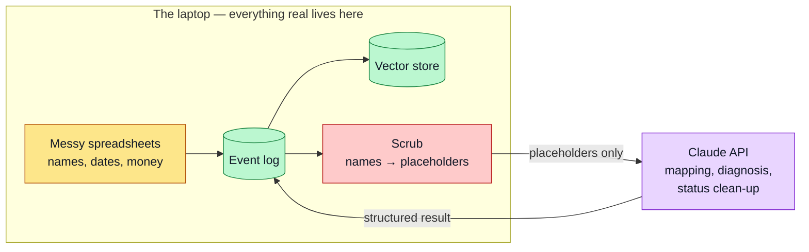

# Privacy and Ethics

The project builds ethics into the code, not just the write-up.

## What leaves the machine, and what does not

Only one arrow crosses the boundary, and the scrub sits on it.

## A human approves every action

The system suggests. A person decides. This holds at both gates. No mapping is trusted, no work is assigned, and no file is written without a human choice. This keeps accountability with the firm and fits the ACM Code of Ethics on human oversight.

## Zero raw personal data to the cloud

The system calls the Claude API for three jobs: mapping inference, diagnosis, and the status clean-up proposal. All three could carry personal data from the spreadsheets. So all three scrub the data first.

Every sample cell in the mapping payload passes through the scrub step. Every evidence excerpt in the diagnosis payload does too. The scrub replaces names and other personal data with placeholders. A test asserts that only placeholders reach the payload.

So no raw personal data leaves the machine. **This is the one implemented privacy control** — not a promise, and not one of two. An earlier design claimed a local model as a second control; that model was withdrawn, and the claim went with it. See [Tech Stack](Tech-Stack).

## Test environment only

All execution testing happens in a test environment. The system never runs against a live company system. The remediation executor writes cleaned copies and never touches the originals. See [Remediation](Remediation).

## Honest about what is known

The system separates what it guessed from what it measured. A cost figure is labelled a projection. An outcome verdict reads only real measurements. And "did it work?" is allowed to answer "not enough evidence yet", which is the truthful answer most of the time. See [Action Layer](Action-Layer).

Approving a fix does not turn it into advice the system will repeat. Only a measured, human-confirmed improvement does.

## Everything is logged

Every executed action is logged with a timestamp. Both gates write decision logs — `mapping_decisions.jsonl` and `decisions.jsonl`. Rejected and ineffective items keep their history too. This gives a full audit trail.

## Transparency

The system always shows its working. It shows the retrieved evidence behind each suggestion. The dashboard even shows the exact scrubbed payload the model saw. The user is never asked to trust a black box.

## Secret handling

The API key lives in a local environment file that is not committed to git. The key must be rotated at the Anthropic console before submission, because it was once pasted in a development chat. This is a known task on the checklist.

## Data consent

The system uses synthetic data. Real firm data is used only as a one-off, consented, supervisor-signed-off export. The system never pulls live data with credentials. See [Scope and Status](Scope-and-Status).
