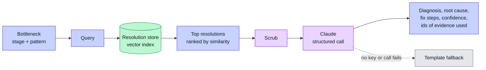
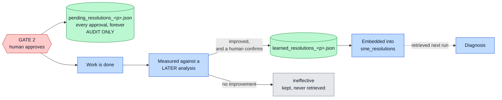

# RAG Diagnosis

This is the reasoning step of the fixed pipeline core. It turns a raw detection into a plain explanation and a fix.

## Why RAG

A model can guess a cause. A guess is not evidence. Staff need a reason they can trust.

So the system grounds each diagnosis in past fixes. This is retrieval-augmented generation, or RAG. The system finds similar past resolutions, then asks the model to reason over them. The user sees which past fixes shaped the answer.

## The retrieval flow



## The resolution store

The knowledge store holds past resolutions. Each entry says how a similar problem was fixed before. The store is a vector index, so the system can search it by meaning, not by exact words.

For each bottleneck, the system builds a short query from the stage and the pattern type. It retrieves the nearest past resolutions. It ranks them by similarity.

## The diagnosis call

The system sends the model a small payload:

- The bottleneck: its type, stage, metric, and how many cases it hits.
- The firm context: the domain and the stage order.
- The past resolutions it retrieved.

The model returns a structured result: a diagnosis, a root cause, a suggested fix with steps, a confidence score, and the ids of the resolutions it used. A structured call means the answer cannot come back malformed.

Every evidence excerpt passes through the scrub step first. No raw personal data reaches the model. See [Privacy and Ethics](Privacy-and-Ethics).

There is a template fallback. If there is no API key or the call fails, the system produces a plain diagnosis from the detection numbers and the top retrieved fix. The pipeline never stalls.

> **One gotcha worth knowing.** The retrieved resolutions are recorded on the
> action item only when the diagnosis runs **online**. Offline, the field is
> initialised empty and never filled, so an offline export produces
> grounding-free data that looks identical in shape to a grounded one. If the
> dashboard shows no "grounded in N past resolutions" block, check whether the
> export was offline before assuming retrieval failed.

## The learning loop — approval is not proof

The system learns from its own fixes. But an approval is a decision, not a result. A manager approving a fix is evidence that it sounded sensible, not evidence that it worked.

So the loop is **outcome-gated**. Two stores, and the gap between them is the point:



`pending_resolutions_<profile>.json` records every approval and is **never embedded and never retrievable as advice**. It is the audit trail. Only `learned_resolutions_<profile>.json` — validated and measurably effective — reaches the vector store.

Entries written under the older approval-is-proof rule can be demoted with:

```
python -m pipeline.learn --profile <p> --migrate-legacy
```

That has already been run for foyle: three entries demoted.

This is what makes the system dynamic in principle. It gets better as the firm uses it — but only on the fixes that actually worked.

**In practice, nothing has passed that bar yet.** Across the nine-week replay, for
both firms, `validated` stayed at 0 while approvals climbed to 3. Nothing was
promoted into the resolution store. The [Evaluation](Evaluation) page reports why:
in a pre-recorded stream, a measured improvement is structurally out of reach. The
[Live Simulator](Live-Simulator) exists to remove that limitation.

A flat learning curve is the honest reading of an outcome-gated loop that has not
yet been given a world it can improve.

## The cost model

Each fix carries a cost estimate, tuned per firm. This helps the user weigh a fix before approving it. The user sees the likely cost, not just the suggestion.

That figure is a **projection** from the firm's cost assumptions, and it is labelled as one. It never counts as evidence that a fix worked. See [Action Layer](Action-Layer).
