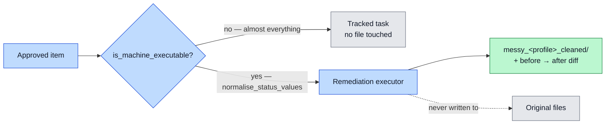

# Remediation

This is the narrow door to automated execution. It carries out approved *data* fixes, and nothing else.

## Two kinds of fix

The project separates two things that sound alike:

- **Bottleneck fixes** are advice for staff. They are process changes, such as a new checklist or a service-level target. Staff act on them.
- **Data remediation** is a change to the data itself. The executor does this.

The remediation executor handles the second kind. It cleans the data. It does not advise staff.

## Only machine-safe items get here

Most approved work never reaches this page. Routing by category is what keeps it that way — an approved "chase the overdue invoices" must not be able to rewrite a status column.

`ActionItem.is_machine_executable` is the only predicate that authorises a file write. See [System Architecture](System-Architecture).

## What the executor does

Small firms type statuses many ways. The same idea reads "done", "Done", "complete", and "finished". This mess blocks clean analysis.

The executor maps free-text status values to a small controlled vocabulary: `Complete`, `Open`, and `N/A`. It turns the mess into three clean values.

## Cleaned copies, not edits in place

The executor never touches the original files. It writes cleaned copies to a separate folder. It also writes a before-and-after diff, so the user can see every change.

This keeps the originals safe. If a change looks wrong, the original is still there. The diff makes each change easy to check.

## Logged and timestamped

The executor logs every action with a timestamp. This gives a full audit trail. Anyone can see what changed, when, and why.

## Kept as a separate process

The executor runs as its own process. It does not import the heavy libraries the rest of the pipeline uses. This keeps it light and avoids a known crash on the local stack. The [Tech Stack](Tech-Stack) page explains the constraint.

## Where it sits in the flow

Remediation runs after Gate 2. Nothing here runs until a human approves. See [Human-in-the-Loop](Human-in-the-Loop).
