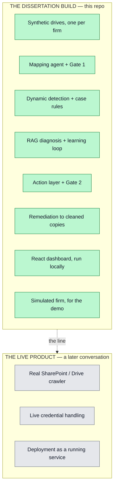

# Scope and Status

## Two separate things

There are two things, and the project keeps them apart:

1. **The dissertation build (this repo).** A local, file-based system that runs on one laptop. It uses synthetic data. It holds no live credentials. This is what gets built, tested, and submitted.

2. **A live product for Foyle.** This is a later conversation. Live connectors, real credential handling, and real-time crawling belong here. None of that is in the dissertation build.

When a task looks like "connect to the real SharePoint" or "handle live OAuth against real data," it falls outside the dissertation scope. When in doubt, build for the dissertation.

Real firm data is used only as a one-off, consented, supervisor-signed-off export. The system never pulls live data with credentials.

## Current status

The core is built and tested. The milestones have shipped:

- Dynamic detection with no markers, plus six generic case-level rules.
- RAG diagnosis with an **outcome-gated** learning loop.
- A LangGraph run that pauses at the approval gate and resumes after a decision.
- A cost model and a zero-PII payload viewer.
- An action layer: ranked ActionItems, an intervention lifecycle, and routing by category.
- A React dashboard, folded to **three tabs**, whose primary view is the **Today** action queue.
- A [Live Simulator](Live-Simulator) whose world responds to approved actions, and a **Demo** tab that runs it.

Three behavioural corrections landed during the build, and all three are load-bearing:

- Execution is **routed by category**, so an approved operational fix can no longer trigger status normalisation.
- The learning loop is **outcome-gated**, so an approval alone no longer creates trusted guidance.
- Outcome measurement is **provenance-guarded** and fails closed, so a simulated week can never become the baseline or the observation for a real intervention.

Generalisability is shown on three firms — an educational-placement firm, a joinery firm, and a professional-services firm — through one core, with zero new reader, detector, or action code for the third.

The evaluation numbers are produced and repeatable, with no outstanding caveats on the mapping table. See [Evaluation](Evaluation).

## What was removed, and should not be claimed

A simplification pass cut roughly 2,100 lines. Every published number was
re-verified afterwards, and none moved.

- **Six ingest sources** and their readers, generators and exporters. `messy` and `local` remain.
- **The local-model anomaly pass.** See [Tech Stack](Tech-Stack).
- **The mock Google Workspace paths.** The GCP project and credentials still exist outside the repo, but the code that used them is gone. Write it up as an early connectivity spike that proved the approach and was superseded — not a component of the delivered system.
- **Two dashboard tabs**, the workflow DAG, the case-aging buckets, the "cases clean" donut, and the **impact-history sparklines**. The RAG grounding those tabs carried was moved onto the action card first, so no contribution was lost — but the trend view is genuinely gone.

## Still open

- Retarget the longitudinal replay onto the simulator and regenerate the curves. This is where `validated` gets its first real chance to move off 0.
- Generalise `simulator/render.py`, which still hard-codes advisory filenames.
- Put a number beside the Ollama development finding — machine spec, model, rough latency.
- Update the dissertation sections that describe detection and evaluation, for the dynamic detector, the action layer, and the reseeded/replay numbers.
- Rotate the API key before submission.
- Supervisor sign-off on the consented Foyle export.

## Constraints

- Feature freeze: 1 August 2026 — passed. Only bug fixes, evaluation, and writing from here.
- Report submission: 24 August 2026.
- Viva: 31 August 2026.

This wiki reflects the build as it stands during the write-up phase. **281 tests pass.**
