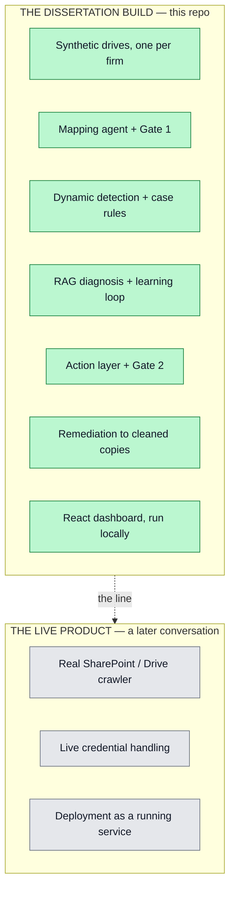

# Scope and Status

## Two separate things

There are two things, and the project keeps them apart:

1. **The dissertation build (this repo).** A local, file-based system that runs on one laptop. It uses synthetic data. It holds no live credentials. This is what gets built, tested, and submitted.

2. **A live product for Foyle.** This is a later conversation. Live connectors, real credential handling, and real-time crawling belong here. None of that is in the dissertation build.

When a task looks like "connect to the real SharePoint" or "handle live OAuth against real data," it falls outside the dissertation scope. When in doubt, build for the dissertation.

Real firm data is used only as a one-off, consented, supervisor-signed-off export. The system never pulls live data with credentials.

## Current status

The core is built and tested. The milestones have shipped:

- Dynamic detection with no markers, plus six generic case-level rules.
- RAG diagnosis with an **outcome-gated** learning loop.
- A LangGraph run that pauses at the approval gate and resumes after a decision.
- A local model for an exploratory anomaly pass.
- A cost model, an impact history, and a zero-PII payload viewer.
- An action layer: ranked ActionItems, an intervention lifecycle, and routing by category.
- A React dashboard whose primary view is the **Today** action queue.

Two behavioural corrections landed during the build, and both are load-bearing:

- Execution is **routed by category**, so an approved operational fix can no longer trigger status normalisation.
- The learning loop is **outcome-gated**, so an approval alone no longer creates trusted guidance.

Generalisability is shown on three firms — an educational-placement firm, a joinery firm, and a professional-services firm — through one core, with zero new reader, detector, or action code for the third.

The evaluation numbers are produced and repeatable. See the [Evaluation](Evaluation) page, including its two live caveats.

## Still open

- Re-run the longitudinal replay under the outcome-gated loop and re-cite the curves.
- Run the advisory mapping audit online to fill the LLM column.
- Decide whether to restore the foyle approved mapping from git after the browser re-approval.
- Rotate the API key before submission.
- Supervisor sign-off on the consented Foyle export.

## Constraints

- Feature freeze: 1 August 2026. After this, only bug fixes, evaluation, and writing.
- Report submission: 24 August 2026.
- Viva: 31 August 2026.

This wiki reflects the build as it stands during the write-up phase.
