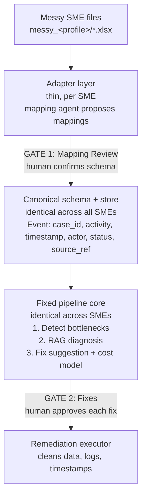

# System Architecture

## The core idea

Think of a travel plug adapter. The appliance never changes. Only the thin adapter that fits the local socket changes per country.

This system works the same way. The pipeline core never changes per firm. Only a thin adapter layer changes. In code terms, the core codes against a fixed schema. Each firm supplies a small config and one approved mapping.

This is the design that makes the [generalisability](Introduction) claim hold.

## The three layers

**Adapter layer (thin, per firm).** This is the only part that changes per firm. A mapping-inference agent reads the messy files and proposes how each column maps to the fixed schema. See [Ingestion and Mapping](Ingestion-and-Mapping).

**Canonical schema (the middle, fixed).** One clean shape for all firms. Every row becomes an `Event` with a case id, an activity, a timestamp, an actor, a status, and a source reference. This is the constant.

**Pipeline core (fixed).** The academic constant. It detects bottlenecks, diagnoses them with RAG, and suggests fixes. It is the same code for every firm.

**Remediation executor.** It carries out approved data fixes and logs each one.

## Two approval gates

The system has two human gates. They run in order:

- **Gate 1, Mapping Review.** The mapping agent proposes schema mappings. A human confirms or edits them before the system trusts any data. The system logs the corrections and the time to decide. These are the measurable human-in-the-loop numbers.

- **Gate 2, Fixes.** The classic approval gate. No fix runs without an explicit human approve, reject, or modify.

The [Human-in-the-Loop](Human-in-the-Loop) page covers both gates in full.

## Two separate stores

The system keeps two stores apart. Do not merge them.

- **Canonical data store.** The operational data, normalised. This is the "what is happening" data. It lives as an event log.

- **RAG knowledge store.** A searchable index of past resolutions. This is the "how similar problems were fixed" knowledge. It is a vector store the diagnosis step searches.

## How the steps run

A graph runs the steps in order: detect, retrieve, diagnose, gate, execute. The gate is a stop point. A fresh run pauses at the gate and writes its state to a file. After a human decides in the dashboard, a resume run reads the decision and carries on from the gate. This is a two-phase run with no hidden state. The run-state file is the audit record.

## What stays fixed when a firm is added

Adding the second firm needed a config block and one approved mapping. It needed zero new reader code and zero new detector code. That result is the proof behind the generalisability claim.
