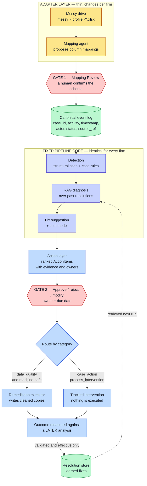
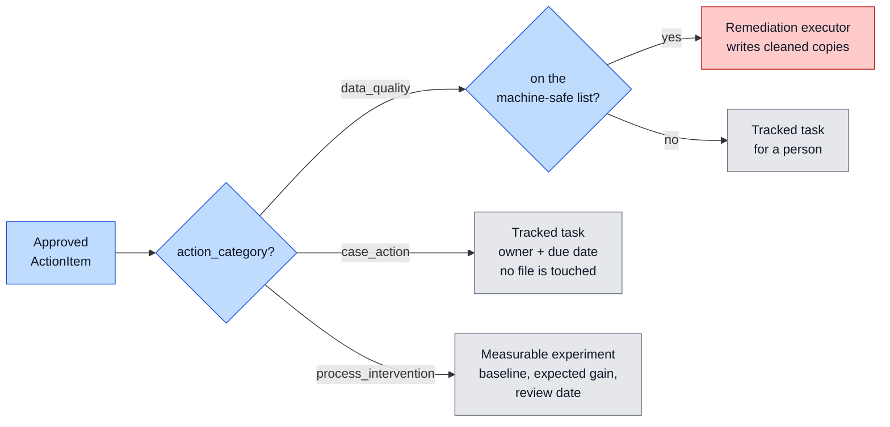

# System Architecture

## The core idea

Think of a travel plug adapter. The appliance never changes. Only the thin adapter that fits the local socket changes per country.

This system works the same way. The pipeline core never changes per firm. Only a thin adapter layer changes. In code terms, the core codes against a fixed schema. Each firm supplies a small config and one approved mapping.

This is the design that makes the [generalisability](Introduction) claim hold.

## The whole system

**Adapter layer (thin, per firm).** The only part that changes per firm. A mapping-inference agent reads the messy files and proposes how each column maps to the fixed schema. See [Ingestion and Mapping](Ingestion-and-Mapping).

**Canonical schema (the middle, fixed).** One clean shape for all firms. Every row becomes an `Event` with a case id, an activity, a timestamp, an actor, a status, and a source reference. This is the constant.

**Pipeline core (fixed).** The academic constant. It detects bottlenecks, diagnoses them with RAG, and suggests fixes. It is the same code for every firm.

**Action layer (generic).** It turns findings into ranked, ownable work. See [Action Layer](Action-Layer).

**Remediation executor.** It carries out approved *data* fixes and logs each one. See [Remediation](Remediation).

## Routing: the three kinds of recommendation

This split is load-bearing. It is what stops an approved "chase the overdue invoices" from quietly rewriting a spreadsheet's status column.

`ActionItem.is_machine_executable` is the single predicate that authorises a file write. Only templates on `MACHINE_EXECUTABLE_TEMPLATES` — currently just `normalise_status_values` — pass it. Nothing else in the system may write to a drive.

## Two approval gates

The system has two human gates. They run in order:

- **Gate 1, Mapping Review.** The mapping agent proposes schema mappings. A human confirms or edits them before the system trusts any data. The system logs the corrections and the time to decide. These are the measurable human-in-the-loop numbers.

- **Gate 2, Fixes.** The classic approval gate. No action is assigned and no data is written without an explicit human approve, reject, or modify.

The [Human-in-the-Loop](Human-in-the-Loop) page covers both gates in full.

## Approval is not proof

An approved fix is a decision, not a result. The system keeps the two apart, and only a measured improvement earns the right to be retrieved as advice later. See [Action Layer](Action-Layer) for the lifecycle and [RAG Diagnosis](RAG-Diagnosis) for what enters the knowledge store.

## Two separate stores

The system keeps two stores apart. Do not merge them.

- **Canonical data store.** The operational data, normalised. This is the "what is happening" data. It lives as an event log.

- **RAG knowledge store.** A searchable index of past resolutions. This is the "how similar problems were fixed" knowledge. It is a vector store the diagnosis step searches.

## How the steps run

A graph runs the steps in order: detect, retrieve, diagnose, gate, execute. The gate is a stop point. A fresh run pauses at the gate and writes its state to a file. After a human decides in the dashboard, a resume run reads the decision and carries on from the gate. This is a two-phase run with no hidden state. The run-state file is the audit record.

## Provenance: knowing which drive an answer came from

Outcome measurement compares two analyses. If one of them came from a different
drive, the comparison is meaningless — and once the [Live Simulator](Live-Simulator)
exists, a simulated week can look identical in shape to a real one.

So every `AnalysisSnapshot` records the drive it was built from, and the outcome
review **fails closed**: it refuses a snapshot whose origin is simulated, and it
refuses a snapshot whose origin is unknown. A snapshot written before the field
existed counts as unknown. Refusing is the correct behaviour; guessing is not.

The dashboard surfaces the same fact — an amber strip on the Today tab names the
drive whenever the queue was built from an alternate one.

## Only two ingest sources

`ingest.py` takes `--source messy` (a per-firm messy drive) or `--source local`.
Six earlier sources built for the original Foyle model — including the Google
Sheets paths — were removed once the messy-drive flow replaced them. `--drive
<path>` re-analyses a later snapshot of an already-mapped drive without a second
trip through Gate 1.

## What stays fixed when a firm is added

Three firms now run through this core. Adding the second and the third each needed a config block, a synthetic drive, and one approved mapping. Each needed **zero** new reader code, zero new detector code, and zero new action code. That result is the proof behind the generalisability claim.

The claim is about the **product**. It does not yet hold for the simulator, whose
renderer still hard-codes advisory filenames. See [Live Simulator](Live-Simulator).
