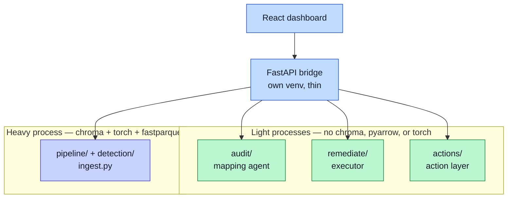

# Tech Stack

The stack is chosen to run on one laptop, with no GPU and no cloud infrastructure.

## What runs where

| Layer | Tool | Notes |
|---|---|---|
| Pipeline graph | LangGraph | Runs the steps: detect, retrieve, diagnose, gate, execute. |
| Action layer | Pure Python + pydantic | Models, lifecycle, ranking, routing. No heavy imports on purpose. |
| Mapping agent | Claude API | Reads messy files, proposes mappings. Scrubbed payload. |
| Diagnosis agent | Claude API | Grounds a fix in past resolutions. Scrubbed payload. |
| Anomaly pass | Ollama (local) | Exploratory only. Aggregate stats. Skips if absent. |
| Vector store | ChromaDB | Powers the RAG resolution store. |
| Embeddings | sentence-transformers | Turns text into vectors, locally. |
| Dashboard | React | Vite, Tailwind, and a flow library for the workflow diagram. |
| Backend | FastAPI | A thin bridge that shells out to the pipeline. |
| File parsing | openpyxl and pandas | Reads Excel and tabular data. |
| Parquet | fastparquet | The event log format. Pinned on purpose; see below. |
| Environment | Python and venv | Version-pinned per repo. |

## Local and cloud, split by need

The design splits work by privacy need:

- **Local** for exploratory analysis. The anomaly pass runs on a local model. Its data never leaves the machine, and it costs nothing to run.
- **Cloud plus scrub** for the two precise tasks. The mapping and diagnosis agents call the Claude API, but only after the scrub removes personal data.

## Why the versions are pinned

The requirements are pinned to a known-good set. This is not fussiness. The latest wheels of some native libraries failed to load their DLLs on the build machine. The pinned set loads cleanly and keeps the whole project repeatable. It is CPU-only and needs no GPU.

## The parquet constraint, and why processes are split

The project uses fastparquet, not pyarrow. Importing pyarrow eagerly loads the Arrow C++ runtime, which segfaults in-process alongside the vector store and the model libraries on Windows. fastparquet writes the same file without that runtime. This pin is deliberate — do not "helpfully" swap it.

The same constraint shapes the process layout. Some parts must stay clear of the heavy runtimes entirely:

The bridge shells out to each one and returns plain JSON. Nothing in the light box may import chromadb, pyarrow, or torch.

## Graceful when parts are missing

The system degrades well. With no API key, the agents fall back to templates and heuristics. With no local model, the anomaly pass skips. Nothing stalls the pipeline. The [How to Run](How-to-Run) page shows the light path.
