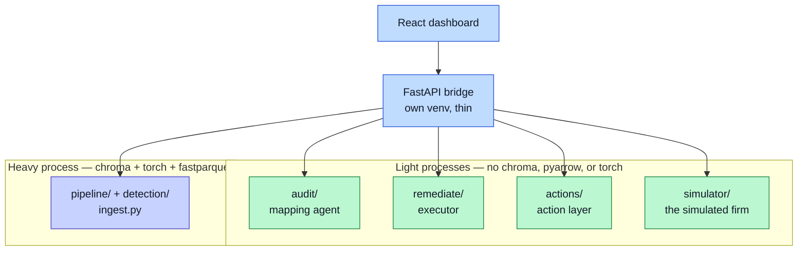

# Tech Stack

The stack is chosen to run on one laptop, with no GPU and no cloud infrastructure.

## What runs where

| Layer | Tool | Notes |
|---|---|---|
| Pipeline graph | LangGraph | Runs the steps: detect, retrieve, diagnose, gate, execute. |
| Action layer | Pure Python + pydantic | Models, lifecycle, ranking, routing. No heavy imports on purpose. |
| Mapping agent | Claude API | Reads messy files, proposes mappings. Scrubbed payload. |
| Diagnosis agent | Claude API | Grounds a fix in past resolutions. Scrubbed payload. |
| Message composer | Claude API | Fills names and figures in simulated client mail. Cached; templates if absent. |
| Vector store | ChromaDB | Powers the RAG resolution store. |
| Embeddings | sentence-transformers | Turns text into vectors, locally. |
| Dashboard | React | Vite and Tailwind. A **sibling repo**, `../hitl-react`, not a subdirectory. |
| Backend | FastAPI | A thin bridge that shells out to the pipeline's venv. |
| File parsing | openpyxl and pandas | Reads Excel and tabular data. |
| Parquet | fastparquet | The event log format. Pinned on purpose; see below. |
| Environment | Python and venv | Version-pinned per repo. |

## Where the model is called

The product calls a model in exactly **three** places:

| Call site | Job |
|---|---|
| `audit/infer.py` | propose the column mappings |
| `pipeline/diagnose.py` | diagnose a stuck stage against past resolutions |
| `remediate/propose.py` | suggest a status clean-up |

Every one of them scrubs its payload first. Everything else in the system —
detection, ranking, the cost figures, the outcome verdict — is deterministic
code. That is deliberate: a worker can argue with arithmetic.

The [Live Simulator](Live-Simulator) adds a fourth call site,
`simulator/compose.py`, but that is System 2, not the product.

## A local model was trialled, then withdrawn

An earlier design ran a local model through Ollama for an exploratory anomaly
pass, and claimed a hybrid local/cloud split as a privacy feature. That is not
what happened.

The local `qwen2.5:7b` was used during development and testing. Running it
locally proved too compute-heavy on the build machine, so it was uninstalled and
the work moved to the Claude API. The pass itself was removed once there was no
engine to drive it — the stored queues confirm it never fired.

The write-up treats this as a **finding, in the past tense**, not a gap.
[Background](Background) argues the SME AI adoption gap is driven by resource
constraints rather than technical sophistication. First-hand evidence that local
inference on a single commodity machine was materially taxing supports that
argument, and it is an observation rather than an assertion.

Two limits on how it is written:

- It is **not** a privacy control of the delivered system. There is one
  implemented privacy control — the zero-PII scrub. See
  [Privacy and Ethics](Privacy-and-Ethics).
- It needs a number beside it — machine spec, the model, and rough observed
  latency or memory pressure, labelled as approximate. Without one it is an
  anecdote.

## Why the versions are pinned

The requirements are pinned to a known-good set. This is not fussiness. The latest wheels of some native libraries failed to load their DLLs on the build machine. The pinned set loads cleanly and keeps the whole project repeatable. It is CPU-only and needs no GPU.

## The parquet constraint, and why processes are split

The project uses fastparquet, not pyarrow. Importing pyarrow eagerly loads the Arrow C++ runtime, which segfaults in-process alongside the vector store and the model libraries on Windows. fastparquet writes the same file without that runtime. This pin is deliberate — do not "helpfully" swap it.

The same constraint shapes the process layout. Some parts must stay clear of the heavy runtimes entirely:



The bridge shells out to each one and returns plain JSON. Nothing in the light box may import chromadb, pyarrow, or torch. `simulator/` is stricter still: it may not import `detection/`, `pipeline/`, `eval/`, or `bridge/` either, because it must not be able to see the product it feeds.

## Two repos, side by side

The dashboard is a **sibling directory**, not a subdirectory:

```
bottleneck-ingest/     the pipeline — this repo
hitl-react/            the dashboard + its FastAPI bridge
```

`hitl-react/api/main.py` resolves the pipeline as `_HERE.parent.parent / "bottleneck-ingest"`, so that relationship is load-bearing. Looking for the dashboard inside this repo finds nothing.

## Graceful when parts are missing

The system degrades well. With no API key, the agents fall back to templates and heuristics, and the simulator's client mail falls back to templates without changing what happens in the world. Nothing stalls the pipeline. The [How to Run](How-to-Run) page shows the light path.
